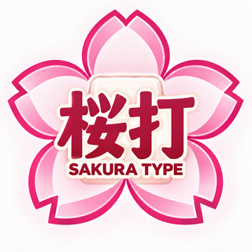

# 桜打 — SAKURA TYPE（v1.0.0）

特別支援学校高等部の情報の授業で使う、日本語タイピング学習アプリです。
ローマ字の習得から、正確さ・速さの向上、漢字変換を含む文章入力までを練習できます。
学校の PC、Surface、ノート PC、iPad、スマートフォンのブラウザで動きます。



---

## 1. 使える段階は2つあります

| 段階 | できること | 必要な準備 |
|---|---|---|
| **① ゲストで練習** | タイピングモード（ローマ字入力・文章入力〈変換あり〉）、ガイド、結果表示、その場での前回比較 | **なし**（このリポジトリをビルドして置くだけ。外部サービスの設定は不要） |
| **② ログインして練習** | ①に加えて、ID とパスワードでのログイン、記録と設定のクラウド保存（どの端末からでも続きができる）、先生用の画面（クラス・生徒・教材の管理、成長グラフ） | Supabase（認証とデータベースのサービス）の設定。[docs/setup.md](docs/setup.md) の手順で行います |

> **大切**：②の設定をしていない状態では、入口の「ログインして練習」は押せず、「ログイン機能はまだ設定されていません」と表示されます。
> 設定前にログインや記録の保存ができるように見せることはありません。

この版でのモード：

- ① **タイピングモード**：使えます
- ② **桜打クエスト**：準備中（押せません）
- ③ **検定モード**：準備中（押せません。将来「見本を見ながら、アプリ内の白紙A4文書に文章を作成する」機能を予定）

---

## 2. まずゲストで動かしてみる（先生の PC で）

1. [Node.js](https://nodejs.org/ja)（バージョン 20 以上）をインストールします。
2. このフォルダーで、ターミナル（Windows では「ターミナル」または「PowerShell」）を開き、次を順に入力します。

   ```
   npm install
   npm run dev
   ```

3. 表示された `http://localhost:5173/` をブラウザで開き、「ゲストで練習」を押します。

学校のサーバーなどに置くとき（公開）：

```
npm run build
```

できた `dist` フォルダーの中身を、Web サーバーの好きな場所（例：`https://学校のサーバー/typing/`）にそのままコピーします。
画像・マニフェストは相対パスで参照し、画面の切り替えは `#/home` のようなハッシュで行うため、**サブディレクトリに置いても動きます**（サーバーの書き換え設定は不要です）。
公開は **HTTPS** で行ってください。

> オフライン対応（電波がない場所での利用）はしていません。アイコン（ホーム画面に追加）の設定は、オフライン対応を意味しません。

---

## 3. ログインと記録の保存を使う（クラウドの設定）

次の順で進めます。くわしい手順は [docs/setup.md](docs/setup.md) にあります。

1. Supabase のプロジェクトを作る
2. データベースの表と権限設定（`supabase/migrations/` の SQL）を入れる
3. 認証の安全設定をする（新規登録を止める、二段階認証、ログイン失敗の制限など）
4. 管理用の Edge Function（`supabase/functions/teacher-admin`）を登録する
5. `.env.example` をコピーして `.env.local` を作り、URL と公開用キーを書いてビルドし直す
6. **最初の教員アカウント**を作る（下の 4.）
7. 先生がログインして、二段階認証を登録し、クラスと生徒のアカウントを作る（下の 5.）

---

## 4. 最初の教員アカウントを作る

教員アカウントは、画面からは作れません（生徒が教員の権限を得られないようにするためです）。
管理者が自分の PC で次を実行します。管理用の鍵（service_role / secret キー）は**ファイルに保存せず**、その場だけ入力します。

Windows（PowerShell）：

```
$env:SUPABASE_URL="https://（プロジェクト）.supabase.co"
$env:SUPABASE_SERVICE_ROLE_KEY="（管理用の鍵）"
npm run create-teacher
```

Mac / Linux：

```
SUPABASE_URL="https://（プロジェクト）.supabase.co" SUPABASE_SERVICE_ROLE_KEY="（管理用の鍵）" npm run create-teacher
```

ID・表示名・パスワード（画面に表示されません）を聞かれるので入力します。2人目以降の先生も同じ方法で作ります。
終わったらターミナルを閉じてください（鍵が残らないようにします）。

作った先生がアプリでログインすると、**二段階認証（認証アプリ）の登録画面**が出ます。スマートフォンの認証アプリ（Google Authenticator、Microsoft Authenticator など）で QR コードを読み取り、6けたのコードを入力します。
認証アプリの端末をなくしたときは、管理者が次を実行して登録を解除します（次のログインで登録し直し）：

```
npm run create-teacher -- --reset-mfa 先生のID
```

---

## 5. 生徒のアカウントを発行する

生徒による自由な新規登録はありません。先生が発行します。メールアドレスや本名は登録しません。

1. 「ログインして練習」→ 先生の ID・パスワード → 確認コードでログインします。
2. 「先生用の画面」→「クラスと生徒」で、**クラスを作成**します（例：1年A組 情報）。
3. 「生徒のアカウントを発行」で、ID（例：`sakura01`）、表示名（ハンドルネーム）、初期パスワード（「自動で作る」が便利）を入れて「発行する」。
4. 表示された ID とパスワードを生徒に伝えたら「閉じる」を押します。**パスワードはこのあと誰も見られません**（先生も再設定だけができます）。
5. パスワードを忘れた生徒は、生徒の「くわしく・管理」→「パスワードを再設定」で新しいパスワードを作ります（前のパスワードやほかの生徒と同じパスワードは使わないでください）。

ほかに、生徒ごとの初期設定（練習時間・難易度・ガイド）、表示名の変更、クラスの所属、アカウントの停止・削除、練習履歴と成長グラフの確認、追加教材の登録ができます。
くわしくは [docs/teacher-guide.md](docs/teacher-guide.md)。

---

## 6. 保存する情報と目的（生徒・保護者への説明にも使えます）

ログインした人について、次のものだけをクラウド（Supabase）に保存します。

- 内部のユーザー番号、ID、表示名（ハンドルネーム）、役割（生徒／先生）、クラス
- 学習設定（ガイドの ON/OFF、音、練習時間、難易度）
- 練習ごとに：日時、練習の種類・テーマ・難易度、問題セットとランク基準の版、練習時間、完走か途中終了か、入力のしかた、正しく入力した数、ミスの数、正確率、速さ、ランク

**保存しないもの**：生徒が入力した文章そのもの、1つ1つのキー操作の履歴、メールアドレス、本名。
文章の照合は端末の中で行い、集計した数だけを送ります。
目的は、本人が成長を確かめること、担当の先生が授業で様子を知ることです。記録を見られるのは本人と、そのクラスを担当する先生だけです（データベースの権限設定で確認しています）。

ゲストの結果はクラウドにも端末にも保存しません。

共有の端末では、終わったら必ず「終了してログアウト」を押します。15分間操作がないと自動でログアウトします。ログイン状態はブラウザに保存しないため、再読み込みや画面を閉じてもログアウトします。

---

## 7. 主な仕様

- 練習時間：3分（初期）・5分・10分。開始前に3秒のカウントダウン。一時停止なし。途中終了は可能（完走記録・正式ランクには使いません）。
  時間は開始時刻からの経過で測るため、タブを切り替えても延長されません。
- 速さの単位：ローマ字は「正しい打鍵数／分」、文章は「正しい日本語文字数／分」。
- 正確率：ローマ字 ＝ 正しい打鍵 ÷（正しい打鍵＋ミス打鍵）×100、文章 ＝ 正しく受理した文字 ÷（正しく受理した文字＋累積の誤確定文字）×100。入力ゼロは「—」・「未判定」。
- 24段階ランク（S＋〜G−）。速さと正確率の両方を満たす最も高いランク。アプリ独自の基準で、検定合格などを保証するものではありません。
- 正式ランクは「標準問題」を時間いっぱいまで練習したときだけ。桜モード・難易度を選んだ練習・追加教材は「参考ランク」。
- 記録は「種類・時間・入力方法・問題の種類・テーマ・難易度・問題セットの版」ごとに分け、異なる条件の自己ベストを混ぜません。

採点とランクの詳細は [docs/scoring.md](docs/scoring.md)、ローマ字の対応表は [docs/romaji-table.md](docs/romaji-table.md)、問題データは [docs/questions.md](docs/questions.md)。

---

## 8. 検証（テスト）

| コマンド | 内容 |
|---|---|
| `npm test` | ローマ字判定・文章入力の採点（IME・誤変換・重複加算なし）・ランク境界・計時・出題・初期問題の検証など（自動テスト） |
| `npm run test:db` | データベースの権限テスト（一時的な PostgreSQL に SQL を適用し、生徒・教員の役割で他人の記録が見えないことなどを確認）。PostgreSQL 15 以上が必要 |
| `npm run test:e2e` | 実際のブラウザ（Chromium）での画面テスト。PC・タブレット・スマートフォンの幅、サブディレクトリ配信、IME の変換（CDP で再現）、ログイン〜保存失敗〜再送〜ログアウト（通信はモック） |
| `npm run validate:questions` | 初期問題の重複・読み・使えない文字・文字数・よく似た問題の検出 |
| `npm run check:readings` | 形態素解析の辞書（kuromoji）で読みを照合し、食い違いを一覧にする |
| `npm run typecheck` | 型チェック |

実機でしか確認できない項目（Windows の日本語 IME、iPad Safari など）は、[docs/manual-checks.md](docs/manual-checks.md) に手順があります。

---

## 9. フォルダーの構成

```
src/core/          判定・採点・ランク・計時・出題のロジック（画面から独立。テストあり）
src/data/          初期問題（questions/*.json）と、Supabase との接続（cloud.ts）
src/screens/       画面（入口、ログイン、ホーム、練習、結果、先生用）
src/ui/            キーボード・指のガイド・グラフなどの部品
supabase/migrations/  データベースの表・権限（RLS）・関数
supabase/functions/   管理用 Edge Function（生徒の発行・パスワード再設定・停止・削除）
supabase/tests/       権限のテスト
scripts/           アイコン作成、教員作成、問題の検証など
assets/brand/      アイコンの元画像（sakura-type-original.png）
public/icons/      元画像から作ったアイコン（npm run icons で作り直せます）
docs/              導入手順・先生向けの使い方・採点・安全設定・実機確認
```

バージョン番号は `package.json` の `version` の1か所で管理し、画面右上の表示に自動で反映されます。

## 10. アプリのアイコン

`assets/brand/sakura-type-original.png`（提供された「桜打／SAKURA TYPE」の画像）から、`npm run icons`（ImageMagick が必要）で作っています。
縮小のみで、切り取り・引き伸ばし・描き直しはしていません。

- `public/icons/favicon.ico`（16・32・48px）、`favicon-32.png`、`apple-touch-icon.png`（180px）、`icon-192.png`、`icon-512.png`
- `icon-maskable-192.png` / `icon-maskable-512.png`：maskable 用の別画像。画像全体を56%に縮小し、元画像の地色で余白を付けて、桜と文字が安全領域に収まるようにしています
- アプリ名「桜打 — SAKURA TYPE」、ホーム画面用の短い名前「桜打」（`public/manifest.webmanifest`）
